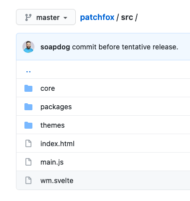
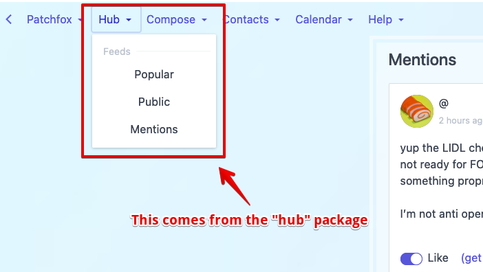
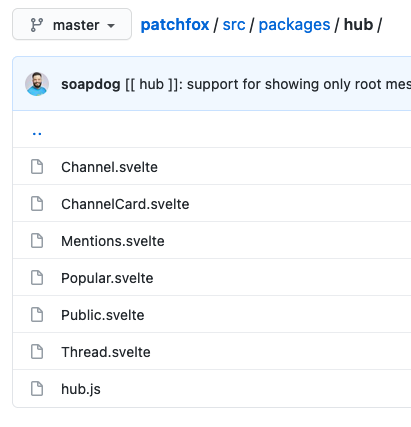
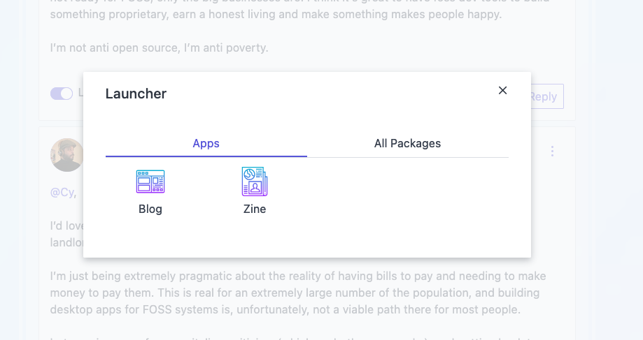
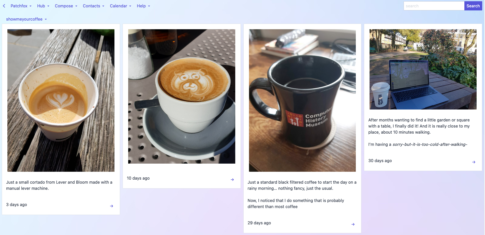

# Packages Documentation

✨ This is the fun part of Patchfox. ✨

This is an excerpt from: [this message](ssb:message/sha256/hYLSp_zPkvUj2f3DMk9vzUafKy9SVruDjuWFmj7vu60=). I will write proper docs for packages, this is just an initial documentation to get something going.

### Patchfox is not a monolith app

Many of the SSB apps are developed as monoliths with tight interdependences between their various parts and features. There is nothing wrong with it and it is a reasonable way of developing a cohesive application. Patchfox went through many rewrites (and it probably needs a couple more) but the current version coalesced into something that resembles an application platform.

There is a [_core_](https://github.com/soapdog/patchfox/tree/master/src/core) which provides the necessary WebExtension features, the shared components, and the platforms. Patchfox has been built with the idea that maybe later I could plug more platforms such as Hyper or IPFS.

These resources from core do not provide features for the user. All they do is create a blank stage in which little applications can coexist and interfere with each other. 

### Packages

Instead of thinking in terms of _applications_, I've settled on the idea of _packages_ which were lifted, at least conceptually, from NewtonOS. Packages may provide additional features to the system, to other apps, and even contain whole new UX experiences that mimic what we now call applications.

Everything in Patchfox is provided by a package.



As can be seen on the shot above, Patchfox main source tree is basically divided between the _core_ and _packages_. A file called [`package.js`](https://github.com/soapdog/patchfox/blob/master/src/packages/packages.js) dictates which packages are loaded. By changing this file, you can completely customise the features you need, and how the user's experience should be.

## Looking closer into some packages

As mentioned above, packages can provide features to the whole system. 

### A closer look into the hub package.

On the screen shot below, I've highlighted the _hub feature_ which is the one that provides the _feed browsing features_.



Zooming into the [hub](https://github.com/soapdog/patchfox/tree/master/src/packages/hub) package folder, we can quickly see that it is providing some feed views: mentions, popular, public, thread, channel. It also provides a `channelCard` which is a specialised view that can appear inside any feed browser. So when you're browsing SSB and see a line saying _This person subscribed to channel whatever._ that is from the `channelCard`. 



All packages have a file named after the package that holds the configuration. In the case of hub, it is called [`hub.js`](https://github.com/soapdog/patchfox/blob/master/src/packages/hub/hub.js). It will list all the views and it is also used to assemble that menu I placed on the screenshot.

A developer can completely replace that package, or turn off features, without dealing with the other packages (with the caveat that some packages will attempt to redirect the user to views from hub, as long as you new package follows a similar API it should be OK)

Below is a snippet from `hub.js` just to show how it looks:

```js
const publicView = require("./Public.svelte");
const threadView = require("./Thread.svelte");
const mentionsView = require("./Mentions.svelte");
const channelView = require("./Channel.svelte");
const channelCard = require("./ChannelCard.svelte");
const popularView = require("./Popular.svelte");

patchfox.package({
  name: "hub",
  public: publicView,
  thread: threadView,
  mentions: mentionsView,
  view: publicView,
  channel: channelView,
  popular: popularView,
  messageTypes: [
        {
          type: "channel",
      card: channelCard,
      short: true
    }
  ],
  menu: {
        group: "Hub",
    label: "Feeds",
    items: [
          {
            label: "Popular",
        event: "package:go",
        data: {
              pkg: "hub",
          view: "popular"
        }
      },
...
```

The hub is probably the most used package in the whole Patchfox.

### A look into the Zine package

On completely different note, the Zine package is mostly unknown. You can only go to it by using the _application launcher_:



It is one of the packages that most resembles the application experience people are used. The Zine app provides a new way to browse channels. It is mostly useful for image heavy channels such as `#showmeyourcoffee`.



This is a very simple app, as can be seen from `zine.js`:

```js
const Zine = require("./Zine.svelte")

patchfox.package({
    name: "zine",
    app: true,
    icon: "newspaper.svg",
    view: Zine
})
```

By saying `app: true`, the package is placed on the _application launcher_. It provides a default view through the `view` property. Launching the app causes that view to open. That's it. 

You can create as many apps for Patchfox as you want and place them in the launcher, or integrate them further in the menus and feed viewers (by providing new cards).

New features such as _ssb-chess_ or _ssb-books_ or even _git-ssb_ could be added by simply creating new self-contained packages and loading them in `packages.js`.

Patchfox is internally more like a Linux distro. It is an opinionated collection of packages with some interdependencies on APIs. Anyone can pick patchfox and replace the packages to create a custom version or even a completely different application.

That is how I attempted to build a little application platform for SSB.
