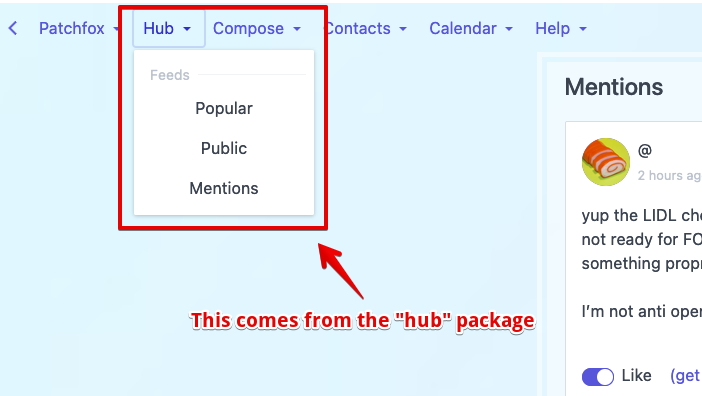
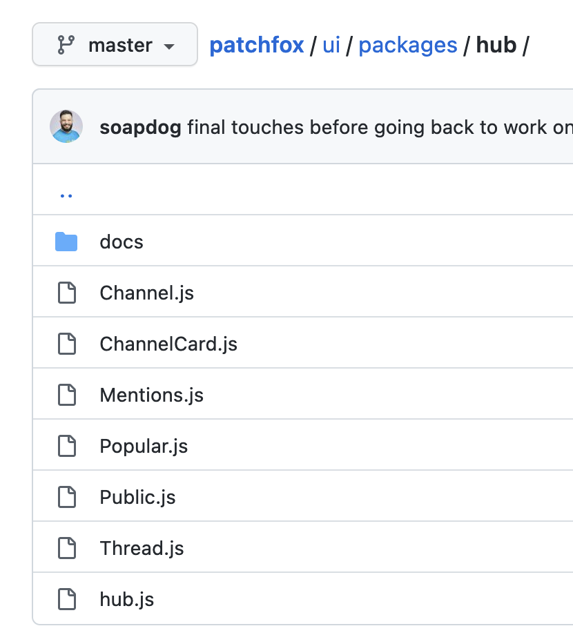
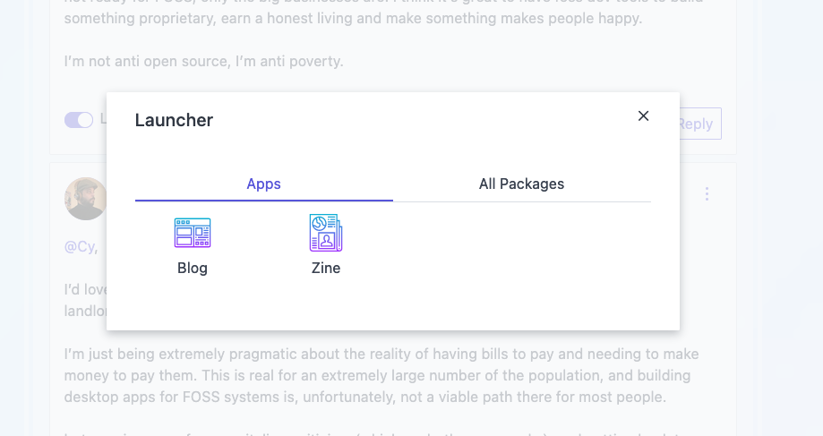

# Packages Documentation

✨ This is the fun part of Patchfox. ✨

Below is an excerpt from [this message](ssb:message/sha256/hYLSp_zPkvUj2f3DMk9vzUafKy9SVruDjuWFmj7vu60=). I will write proper docs for packages--this is just some initial documentation to get something going.

### Patchfox is not a monolithic app

Many SSB apps are developed as monoliths with tight interdependence between their various parts and features. There is nothing wrong with that, and it's a reasonable way of developing a cohesive application. Patchfox has been through many rewrites (and it probably needs a couple more) but the current version has coalesced into something that resembles an application platform.

There is a [_core_](https://github.com/soapdog/patchfox/tree/master/ui/core) which provides the necessary core features upon which the rest of Patchfox is built. Inside it, you'll find the kernel, the shared components, and the platforms. Patchfox is designed in a way that makes it possible to plug in additional platforms such as Hyper or IPFS in the future.

These resources from `core` do not provide features for the user. All they do is create a blank slate on which miniature applications can coexist and avoid interfering with each other.

### Packages

Instead of thinking in terms of _applications_, Patchfox is designed with the idea of _packages_. This concept was lifted, at least conceptually, from NewtonOS. Packages may provide additional features to the system, to other apps, and even contain whole new UX experiences that mimic what we now call applications.

Everything in Patchfox is provided by a package.


As can be seen on the above screenshot, Patchfox's main source tree is divided between the _core_ and _packages_. A file called [`package.js`](https://github.com/soapdog/patchfox/blob/master/ui/packages/packages.js) dictates which packages are loaded. By changing this file, you can customize the features you need, and how the user's experience should be.

## Looking closer into some packages

As mentioned above, packages can provide features to the whole system.

### A closer look into the hub package

In the screenshot below, the _hub feature_ (highlighted in red) provides the _feed browsing features_.



Zooming into the [hub](https://github.com/soapdog/patchfox/tree/master/ui/packages/hub) package folder, we can quickly see that it is providing some feed views: mentions, popular, public, thread, and channel. It also provides a `channelCard` which is a specialised view that can appear inside any feed browser. So when you're browsing SSB and see a line saying _This person subscribed to channel whatever._, that is from the `channelCard`.



All packages have a file named after the package that holds its configuration. In the case of hub, it is called [`hub.js`](https://github.com/soapdog/patchfox/blob/master/ui/packages/hub/hub.js). It will list all the views, and it is also used to assemble the hub menu.

A developer can completely replace that package, or turn off features, without dealing with the other packages (with the caveat that some packages will attempt to redirect the user to views from hub, but as long as your new package follows a similar API it should be OK).

Below is a snippet from `hub.js` just to show how it looks:

```js
const publicView = require("./Public.js");
const threadView = require("./Thread.js");
const mentionsView = require("./Mentions.js");
const channelView = require("./Channel.js");
const channelCard = require("./ChannelCard.js");
const popularView = require("./Popular.js");

patchfox.package({
  name: "hub",
  public: publicView,
  thread: threadView,
  mentions: mentionsView,
  view: publicView,
  channel: channelView,
  popular: popularView,
  messageTypes: [
    {
      type: "channel",
      card: channelCard,
      short: true
    }
  ],
  menu: {
    group: "Hub",
    label: "Feeds",
    items: [
      {
        label: "Popular",
        event: "package:go",
        data: {
          pkg: "hub",
          view: "popular"
        }
      },
...
```

The hub is probably the most used package in all of Patchfox.

### A look into the Zine package

On a different note, the Zine package is less commonly used. You can only encounter it via the _application launcher_:



`Zine` is one of the packages that most resembles the application experience people are familiar with. The Zine app provides a new way to browse channels. It is most useful for image heavy channels such as `#showmeyourcoffee`.


This is a very simple app, as can be seen from `zine.js`:

```js
const ZineView = require("./ZineView.js")

patchfox.package({
    name: "zine",
    app: true,
    icon: "newspaper.svg",
    view: ZineView
})
```

Including the `app: true` property causes `Zine` to be placed in the _application launcher_. `view: ZineView` sets the default view that opens when the user launches the app.

You can create as many apps for Patchfox as you want and place them in the launcher, or integrate them further into the menus and feed viewers by providing new cards.

New features such as _ssb-chess_ or _ssb-books_ or even _git-ssb_ could be added by simply creating new self-contained packages and loading them in `packages.js`.

Patchfox's internal architecture is comparable to a Linux distribution. It is an opinionated collection of packages with some interdependencies and APIs. Anyone can pick up Patchfox and replace the packages to create a custom version or even a completely different application.

That is how I attempted to build a little application platform for SSB.
